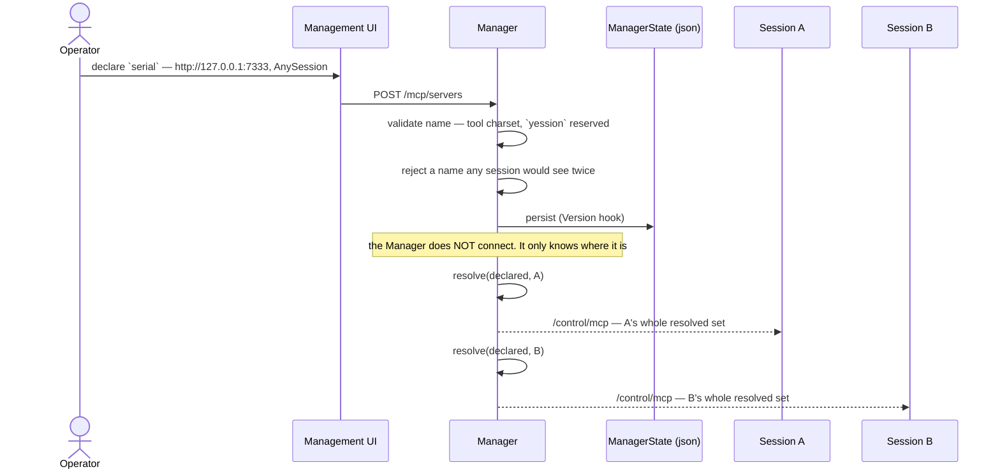
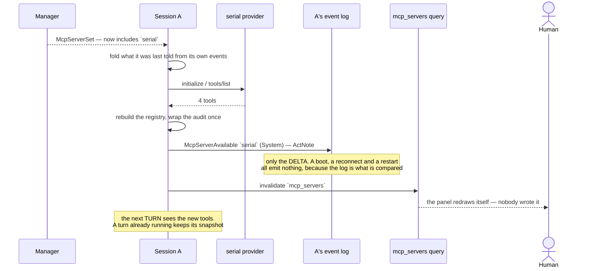
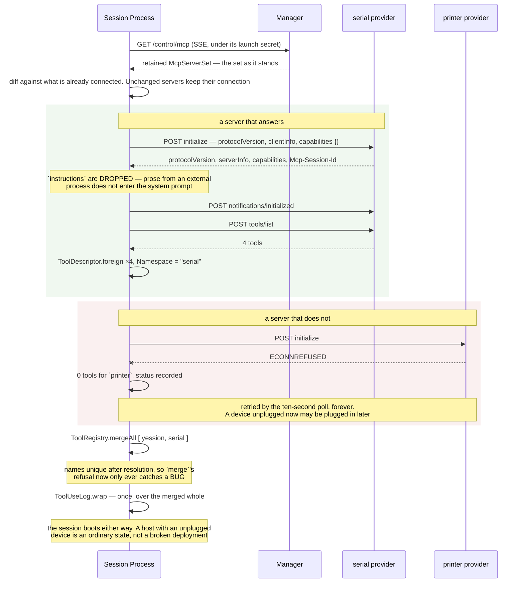
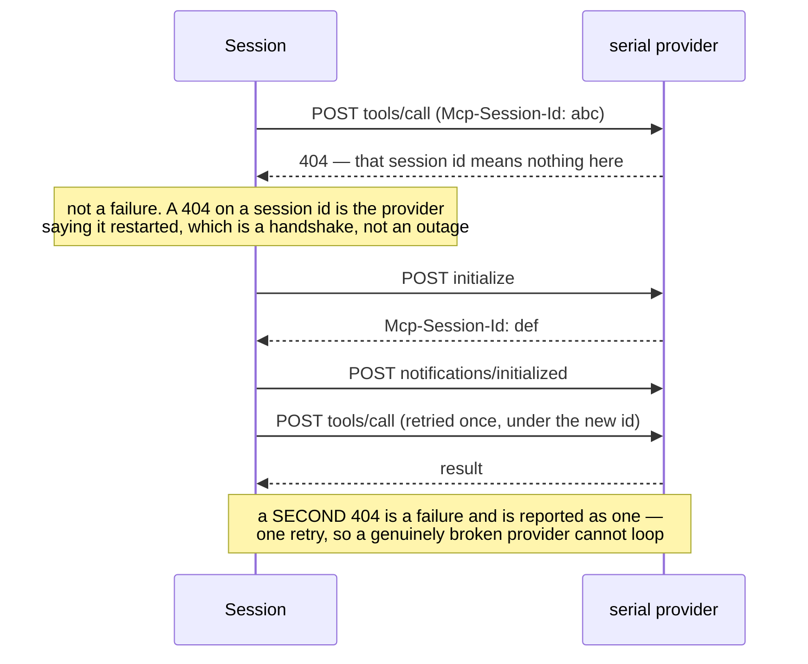
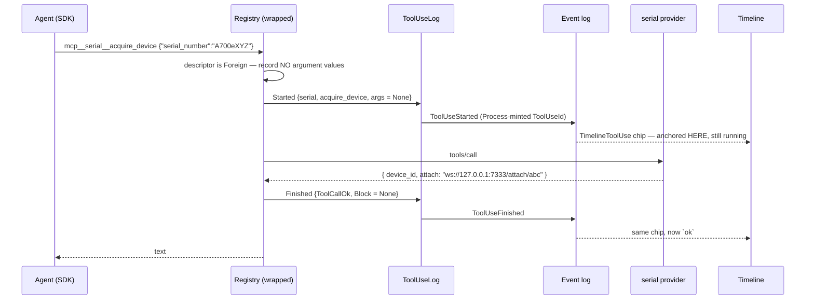
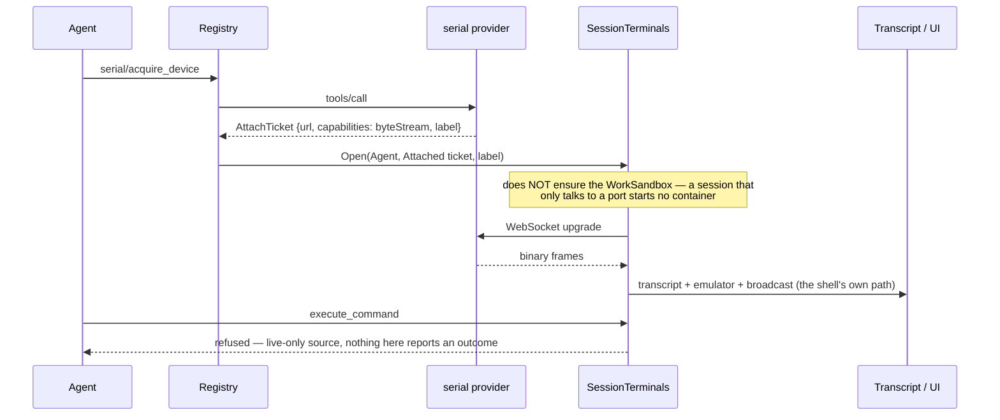
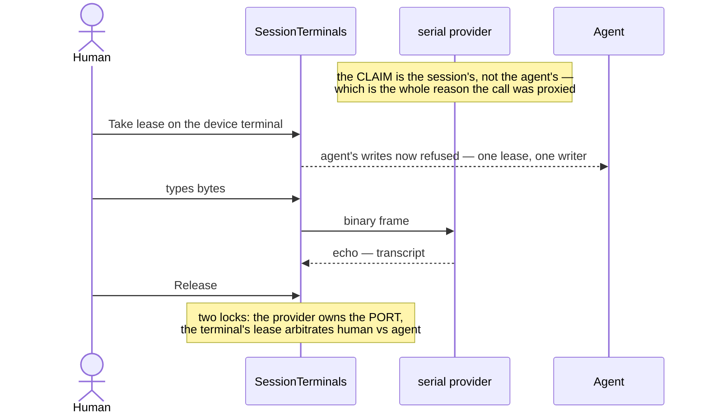
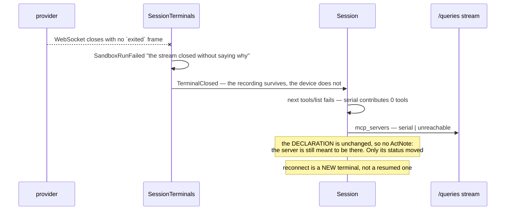

# Plan 17 — Declaring MCP servers

> **Status: all four steps landed.** The missing half of
> [Plan 16 part B](16-serial-devices.md): parts A, C and D had landed, and nothing could yet
> GIVE a session a server — so nothing minted an attach ticket and the serial provider had
> nothing to be a consumer of. That is now closed, and Plan 16 step 5 (the serial provider
> itself) is unblocked.
>
> What changed against the text below, all of it recorded where it happened:
>
> - **`McpServerName` lives in `Identity.fs`**, not `Mcp.fs`. `Events.fs` compiles before
>   `Mcp.fs` and the note events carry a name, so the name is a name like the others.
> - **`McpConnections` is composed by `SessionMain`, not by the Host**, unlike the other
>   reverse legs. What arrives on that leg has two consumers — a turn's registry, which the
>   Host builds, and the `mcp_servers` query, which is the composition root's — and only one
>   of them is the Host's.
> - **`TerminalOpened.Sandbox` became optional** on the way past, which is Plan 16 part D
>   meeting master's named sandboxes rather than anything this plan asked for.
>
> Two drafts were wrong before this one, and both errors are worth keeping written down
> because each one deleted machinery rather than adding it:
>
> 1. **Per-session enablement was put in the management UI**, behind a
>    `POST /sessions/:id/mcp/enable`. Plan 15 had already made the session's read surface
>    GENERATED and read-only, with commands belonging to the agent. Correcting that left only
>    one place a url is ever written, and precedence and shadowing stopped existing.
> 2. **A session then still had to ATTACH what the operator had declared** — an
>    `attach_mcp_server` command, a `SessionRecord` field, an `Automatic` knob, an event pair.
>    All of it ceremony: an operator who declares a server declares it in order for it to be
>    used. Removing the selection layer removed the session-record migration, the commands,
>    and two of six delivery steps.
>
> What is left is one sentence: **the Manager declares, every session it names gets it, live.**

## Why not the org/repo shape after all

GitHub splits this as *the org allows, the repo enables*, and Claude Code as *user / project /
local, most specific wins*. Both were the model for the earlier drafts and both are the wrong
size here.

Selection below policy earns its keep when the broad scope covers **many** narrow ones with
**different owners and different needs** — an org with a thousand repos. A Yession host has
one operator and a handful of sessions, and the reason to declare a serial provider is that
somebody wants a session to talk to it. A gate between "the operator added it" and "a session
may use it", with the same person on both sides, is a step that only ever gets performed.

So the scope survives and the selection does not: a declaration says WHO may reach it, and
everyone it names reaches it.

## The vocabulary

```fsharp
/// What a server is called — and, because Plan 16 part A made a namespace the SDK MCP
/// server's NAME, the namespace every one of its tools lands in. So this is not a label: it
/// is the prefix of every wire name the model sees (`mcp__serial__acquire_device`) and the
/// word the tool-use record shows. Constrained to what a tool name can carry, and `yession`
/// is reserved — the session's own verbs are not something a provider may impersonate.
type McpServerName = private McpServerName of string

/// How to reach it. One case, because localhost HTTP is the only transport this round —
/// a DU rather than a bare url because the wire needs a tag anyway, and because `Stdio`
/// (under Later) changes who owns the process rather than merely where it is.
type McpTransport =
    | McpHttp of url: string

type McpServerRef =
    { Name : McpServerName
      Transport : McpTransport
      /// One sentence, for the humans. NOT sent to the model — the model reads the tool
      /// descriptions the server itself supplies, which is a separate trust problem (below).
      Description : string }

/// WHO reaches it. The whole of the configuration model, because there is no second step:
/// a session this names has the server, from the moment it is declared until it is not.
type McpAudience =
    | AnySession
    | OneSession of SessionId

type McpDeclaration =
    { Server : McpServerRef
      Audience : McpAudience }
```

One place holds it, and **`SessionRecord` is untouched** — which is the clearest sign the
selection layer was not carrying anything:

```fsharp
// src/Yession.Manager/State.fs
type ManagerState =
    { Version : int
      Sessions : SessionRecord list
      /// Host-wide and session-scoped declarations alike. One list, because they are the
      /// same kind of fact — somebody with operator authority said this server exists —
      /// differing only in who reaches it.
      McpServers : McpDeclaration list }
```

## Resolution

```fsharp
/// The servers ONE session gets. Pure, total, and the only place the question is answered,
/// so "why can the agent see this tool" has exactly one answer.
let resolve (declared: McpDeclaration list) (id: SessionId) : McpServerRef list =
    declared
    |> List.filter (fun d ->
        match d.Audience with
        | AnySession -> true
        | OneSession s -> s = id)
    |> List.map (fun d -> d.Server)
```

**No precedence rule, and nothing to shadow.** With declarations in a single place a name
clash is not something to resolve at read time — it is something to REFUSE at declare time,
when the operator is standing there and can pick another name. A `OneSession s` name may not
collide with an `AnySession` name nor with another for the same session, and the Manager
checks it once, on the way in.

That keeps Plan 16's `ToolRegistry.merge` refusal honest for the reason it was written: after
resolution names are unique by construction, so a collision at runtime is necessarily a BUG —
two registries claiming one namespace — rather than a configuration choice somebody made.

## Who does what

Two acts. Plan 15 settled the shape and the settings pane says so in its own comment
(`View.fs`): *"Registering a query is what puts it on this screen — nobody writes a panel…
It is deliberately read-only."*

| act | who | where |
|---|---|---|
| **declare** a server | operator | management UI → `ManagerState` |
| **see** what this session has, and how it is doing | everyone | the `mcp_servers` query |

There is no third act, and in particular **no agent command**. That is not a restriction
imposed for safety; it is what is left when the selection step goes. It happens to land on
the right side of the trust boundary anyway: declaring names a url, which is unbounded, and
nothing the agent can say changes what this session talks to.

## Delivery: the reverse leg finally carries something

`/control/mcp` exists, is subscribed, and is dead — the session-side handler at
`app/Host.fs:527` prints the count and drops it. It carries `McpToolList`. It should carry
the RESOLVED SERVER SET instead, because Plan 16 settled that **the session is the MCP
client**:

```fsharp
/// One frame of `/control/mcp`: the whole resolved set for THIS session, every time.
/// Snapshots, never deltas — a reconnect is then the entire recovery protocol.
type McpServerSet = { Servers : McpServerRef list }
```

This leg matters more now than it did in the earlier drafts, not less: with no attach step it
is the ONLY way a session learns a server exists. Reactivity is the feature.

- **The Manager never becomes an MCP client.** It knows where servers are; it does not talk
  to them. Three things follow: a provider being down cannot affect the Manager, the Manager
  never holds a device claim (which is what would stop a human taking the lease), and there
  is exactly one place a `tools/call` can originate from — which is what makes the tool-use
  record complete.
- **No add-time reachability probe.** Tempting, and it would be a second MCP client answering
  a question the session answers better. The `mcp_servers` query reports live status from the
  process that is actually connected. One mechanism, one truth.
- **`McpTool`/`McpToolList` are not deleted.** They stop being the wire payload and become
  what the session's client decodes `tools/list` INTO. The half that was built gets used.

### Keying the hub

Today: one `RetainedHub<McpToolList>` for the whole Manager, whose own comment says *"which
MCP services exist is infrastructure, the same for every session"*. That premise is what this
plan retires.

Two existing hubs bracket what is needed and neither is it:

| | keyed per session | retained snapshot |
|---|---|---|
| `NotificationHub<'n>` | ✅ by launch control secret | ❌ *"nothing to retain, only future pushes"* |
| `RetainedHub<'a>` | ❌ Manager-wide | ✅ |

So: a **keyed retained hub**, retaining by `SessionId` and delivering by control secret.

- Retention is by **session**, not by secret, because the resolved set must survive a
  relaunch — a restarted session subscribes under a new secret and must be handed the current
  set, not an empty one.
- Delivery is by **secret**, reusing `NotificationHub`'s rule verbatim: a sink dies exactly
  when its launch does, at the same moment the Manager revokes that secret's capabilities.
- The unkeyed `RetainedHub` stays for the session registry, which is genuinely global. Two
  hubs for two genuinely different shapes is not redundancy.

## Two legs, two lifetimes

A session reaches a provider over **two connections that are not the same connection**, and
keeping them apart is the whole reason Plan 16 split control from data:

| | control | data |
|---|---|---|
| protocol | MCP over Streamable HTTP | WebSocket |
| opened | when the server enters this session's set | when the agent acquires a device |
| lives as long as | the server stays in the set | the terminal stays open |
| how many | one per server | one per attached device |
| what it carries | `tools/list`, `tools/call` | bytes, both ways |

The join between them is the attach ticket, and it flows control → data: a `tools/call` on
the control leg answers with a url, and the session opens the data leg to it. Nothing flows
the other way. A device terminal closing does not disturb the control leg, and the control
leg dropping does not close a terminal that is already streaming — it only means no NEW
device can be acquired until it comes back.

## The control leg: initialization

Driven by the set frame, not by a turn. The session must have a registry BEFORE a turn asks
for one, so this happens on arrival of `McpServerSet` and never lazily on first tool call.

### The handshake

MCP's lifecycle, unmodified — we are an ordinary client and the point of that is that the
provider can be anyone's:

1. **`initialize`** — POST, carrying `protocolVersion`, our `capabilities`, and `clientInfo`.
   We declare **no** client capabilities this round: no `roots`, no `sampling`, no
   `elicitation`. A client that declared `sampling` would be offering the provider a way to
   drive the model, which is the opposite of what a proxied server is for.
2. **Server responds** with its `protocolVersion`, its capabilities, `serverInfo`, and
   possibly `instructions`. A protocol version we do not speak is a refusal, recorded as the
   server's status — not an exception, and not a session that fails to boot.
3. **`notifications/initialized`** — POST, no response. The spec requires it before ordinary
   requests, and a provider that enforces it will reject `tools/list` without it.
4. **`tools/list`** — the descriptors, which become `ToolDescriptor.foreign` with
   `Namespace = server name`.

The transport is Streamable HTTP: one endpoint url, client→server messages are POSTs, and
the response is either `application/json` or an SSE stream depending on what the server
chooses. A server that answers `initialize` with an `Mcp-Session-Id` header gets it echoed on
every subsequent request. *The exact header set has churned across spec revisions — pin the
version at implementation and read the current lifecycle page rather than trusting this
paragraph.*

**`instructions` are dropped, deliberately.** MCP lets a server return prose intended for the
model's system prompt. That is the prompt-injection surface of Trust above, in its most direct
form — a string from an external process, concatenated into the system prompt, ahead of
everything the operator wrote. Tool descriptions we cannot avoid (the model must read them to
call anything); `instructions` we can, so we do.

### A poll, not a GET stream

> **Revised after the first draft.** The original text argued a device provider's tool list is
> **static** — `list_devices` is a tool, the devices are its result — and therefore no
> server-initiated channel was needed. That was right about the tool list and wrong about
> everything else it implied, and the gap it wrote down ("a server that genuinely changes its
> tool list will not be noticed") turned out to be the smaller half of the problem.

Streamable HTTP allows a client to open a GET SSE stream for server-initiated messages —
principally `notifications/tools/list_changed`. We do not open it. Instead the session
**re-asks every declared server every ten seconds**.

The poll answers two questions the set frame cannot, and the second is the one that matters:

- **A tool list that changed.** Exactly what the GET stream would have carried, without a
  long-lived connection per server to supervise. It also stops the static-tool-list claim
  from being load-bearing: a provider is now free to express plug-and-play as tools that come
  and go, and the session picks them up. That is how USB plug-and-play reaches the model
  without anyone re-declaring anything.
- **A provider that is not there when its declaration arrives.** Started later, restarted, a
  device host that came back. The declaration never changed, so no set frame is coming, and a
  bounded backoff gives up — hardware does not stay gone on a schedule. Before the poll, a
  provider that missed its first handshake was unreachable for the life of the session.

**One mechanism, not two.** An earlier draft retried the FIRST connect on a
`Resilience.Policy.guard` backoff and left the long tail to a stream it never opened. The
poll is that backoff's steady state and the stream's replacement at once, so `connect` makes
exactly one attempt and there is a single answer to "when does this notice" rather than two
that can disagree. The cost is bounded and stated: a provider is available up to one interval
after it comes up.

A connected server is **re-listed, not re-handshaked**, so its `Mcp-Session-Id` survives a
tick; a `404` on that re-list is the restart case below. A tick where nothing moved reports
nothing, so the `mcp_servers` panel does not redraw on a timer.

**Still no note for a status change.** A provider coming up or going away moves a STATUS, not
a declaration — the server is still meant to be there — so it lands in the query and not in
the timeline. The `ActNote` pair stays declaration-driven.

### Reconnection, and what is NOT torn down

Every set frame is a whole snapshot, so the session diffs it against what it currently holds:

- **Unchanged servers keep their connection.** Rebuilding every client because one was added
  would drop `Mcp-Session-Id`s and re-run handshakes for servers nothing happened to.
- **Removed servers are disposed**, and their tools leave the registry at the next turn.
- **A provider that restarts** invalidates its session id, and the next request answers `404`.
  That is a re-`initialize`, not a failure: the client re-handshakes once and retries the
  request. A second `404` is a failure and is reported as one.
- **A provider that is down is retried by the POLL**, not by a backoff around the connect —
  see above. Every attempt updates the `mcp_servers` status rather than logging, because a
  device unplugged now may be plugged in later and that is a state, not an incident.

### What a turn sees while this is happening

`capabilitiesFor : AgentTurnId -> AgentCapabilities` resolves per turn, so the registry is
snapshotted at the turn's start. Three consequences:

- A turn that begins mid-handshake gets the registry as it stood — without the new server.
  Never a half-built one.
- A turn already running is unaffected by a set change. Its tool list cannot shift under the
  model, which would make the SDK's `allowedTools` and the servers disagree.
- The new tools appear on the NEXT turn, and the `ActNote` (below) is what tells that turn why.

## Runtime: from a set to a registry

- On every set frame the session rebuilds its foreign registries: `initialize`, `tools/list`,
  one `ToolDescriptor.foreign` per tool with `Namespace = server name`.
- `ToolRegistry.mergeAll [ yession; …foreign ]`, then `ToolUseLog.wrap` **once** over the
  merged whole. Applying it per-server would let a provider added later arrive with its own
  logging, or with none.
- **Foreign, so no argument values are recorded.** Already implemented and tested: we did not
  write those schemas and cannot trust them to mark their own secrets. The record still says
  where the call went and how it ended.
- **A turn holds a snapshot.** `capabilitiesFor : AgentTurnId -> AgentCapabilities` already
  resolves per turn; the registry rides that. A set change mid-turn lands on the NEXT turn, so
  the model's tool list never changes underneath it.
- **A server that is down contributes zero tools and never fails anything.** Not a startup
  error, not a failed turn — the agent simply does not have those tools, and the query says
  why. A host with an unplugged device is an ordinary state, not a broken deployment.

## A set that changes is a fact a later turn needs

With no attach command there is no human act to record — but the SESSION still gains and
loses whole namespaces of tools while it is running, and Plan 16 part C's question applies
directly: not *"did the agent do it"* but **"does a future turn need to be told?"**. A turn
that suddenly has four serial tools it did not have before needs to know why, and a human
scrolling back needs to see when the agent gained them.

```
| McpServerAvailable   of { MessageId; Name; Actor = System }   -> ConversationItemKind.ActNote
| McpServerUnavailable of { MessageId; Name; Actor = System }
```

Three things make this honest rather than noisy:

- **`ActNote`, not a new kind.** Master renamed `RepoNote` when stage 2 landed, with the
  reason on the case: *"every command the agent gains lands here — a kind per capability
  would be a renderer per capability."* This is that case.
- **`ActorRef.System`,** because nobody in the session did it. Attributing it to the agent or
  to whoever happens to be connected would be inventing an actor.
- **The delta is computed against the LOG, not against memory.** The Process folds what this
  session was last told from its own events, compares that to the newly resolved set, and
  appends only the difference. So a boot emits nothing (the registry is simply built), a
  reconnect emits nothing, a process restart emits nothing — and only a genuine change by the
  operator produces a note. Comparing against an in-memory previous set would re-announce
  everything after every restart.

## Observability, for free

An `mcp_servers` **query** (Plan 15). `queriesSection` maps over whatever the session
declared, so registering it IS the UI change — no panel to write, no route to add, and the
WCAG floor is already held once in `queryValueView` for every query that will ever exist:

| server | audience | transport | status | tools |
|---|---|---|---|---|
| `serial` | this session | `http://127.0.0.1:7333` | connected | 4 |
| `printer` | any session | `http://127.0.0.1:7401` | unreachable | 0 |

It is also the answer to "how does an operator find out they typo'd a url" — no add-time
probe needed.

## Trust

Plan 16 named three gaps. This plan closes one and scopes the others:

- **Closed: who may add a server.** An operator, in the management UI. There is no path by
  which the agent gives itself one, and none by which a session names a url.
- **Open, and narrowed: tool descriptions are untrusted text in the model's context.** An
  external server's `description` goes straight into the prompt, and with always-available
  servers it does so without a second human ever confirming. `ToolDescriptor.Foreign` already
  marks exactly the set this applies to. The mitigation belongs on the DECLARATION, where the
  operator already is — an `AutoApprove : bool` defaulting to false, so foreign tools are
  announced but gated — and not in a per-call prompt, which is a UI this plan does not need.
  *This is the one place the selection layer was genuinely doing something, and dropping it
  moves the burden here rather than deleting it.*
- **Open: a provider is unconfined.** No srt/docker analogue for a tty, and terminal access
  already equals session access. Worth stating in GAPS rather than discovering.
- **Still no credentials.** localhost, unauthenticated. When they arrive they belong in
  Connections/Secrets (Plans 06/08), not in a `headers` field on the declaration — which is
  why there is deliberately no such field to fill in wrongly.

## Critical flows

### 1 — An operator declares a server

The only act that names a url, and the only one that is not read-only.



### 2 — …and every session it named has it, live

No attach, no command, no button. The reactive leg IS the mechanism.



### 3 — The control leg, initialized

The MCP lifecycle in full, and what happens to the server that is not there. Driven by the
set frame, so it is complete before any turn asks for a registry.



### 3b — The provider restarted underneath us



### 4 — A proxied call, recorded



### 5 — Ticket to terminal: part B meets part D



### 6 — The human takes the same device



### 7 — A provider dies mid-session



## Delivery

1. ✅ **Vocabulary + resolution.** `McpServerName`, `McpTransport`, `McpServerRef`,
   `McpAudience`, `McpDeclaration`, `resolve`, and the declaration-time uniqueness check.
   Pure, cheap tier, ships alone.
2. ✅ **Persistence + the reactive leg.** `ManagerState.McpServers` behind the `Version` hook,
   the keyed retained hub, and `/control/mcp` carrying `McpServerSet`. The session-side
   handler stops printing a count and starts holding the set. *No `SessionRecord` change.*
3. ✅ **The MCP client + proxy registry.** The lifecycle (`initialize`,
   `notifications/initialized`, `tools/list`, `tools/call`) over Streamable HTTP, the
   connection diff, the one-retry re-handshake on a stale session id, `ToolDescriptor.foreign`,
   merged and wrapped. `Ports` tier against a loopback MCP server written by hand, the way
   Plan 16's loopback WebSocket peer was — the point being that a third party can implement
   the other end, and a peer built on a library would only prove the two agreed.

   The split follows the repo's existing one: the JSON-RPC envelopes and the tool codecs are
   Thoth codecs in the DOMAIN (testable with no socket), and the POSTing is in the Host beside
   `Sse.fs`.
4. ✅ **The declaration form, the `mcp_servers` query, and the delta notes.** The query is a
   registration; the form is the only new surface in the plan; the notes are the log fold
   that keeps a boot silent and a change loud.

Steps 1–2 make a session's set reachable, 3 makes it useful, 4 makes it legible. Plan 16 step
5 (the serial provider) needs 1–3, and now has them.

## What landing this changed, and what it did not

**Changed.** An operator can declare an MCP server host-wide or for one session, and every
session it names reaches it live — no attach, no button, no restart. A session's agent gets
those tools under the server's own namespace on its next turn; the timeline says when it
gained them and the `mcp_servers` query says how each is doing. `/control/mcp` carries
something for the first time.

**Not changed, and worth being explicit about.** Nothing here knows what serial is. The
provider that turns `/dev/ttyACM0` into an MCP server is still Plan 16 step 5, and it is
separately shippable precisely because this plan has no idea it is coming: a device that
speaks MCP over HTTP natively is declared exactly the same way, with no provider at all.

The gaps this leaves are the ones Trust names above and one of its own: a server that
changes its tool list while attached is not noticed (no GET stream), and `AutoApprove` is
still the mitigation that was moved to the declaration rather than built.

## Later, deliberately not now

- **`McpStdio of command * args`.** The obvious second transport, and it answers Plan 16's
  open question *"provider lifecycle is nobody's"* — a stdio server is a child process, and
  the Manager already supervises child processes (`Spawn.fs`, `ProcessManager`). Left out
  because it changes WHO OWNS THE PROCESS, a bigger decision than a second url scheme, and
  because the DU makes adding it a case rather than a rewrite.
- **`AutoApprove` on the declaration.** See Trust — the gating that the removed selection
  layer was incidentally providing, put where the operator already is.
- **Credentials.** Connections/Secrets, when there is a non-localhost server to want them.
